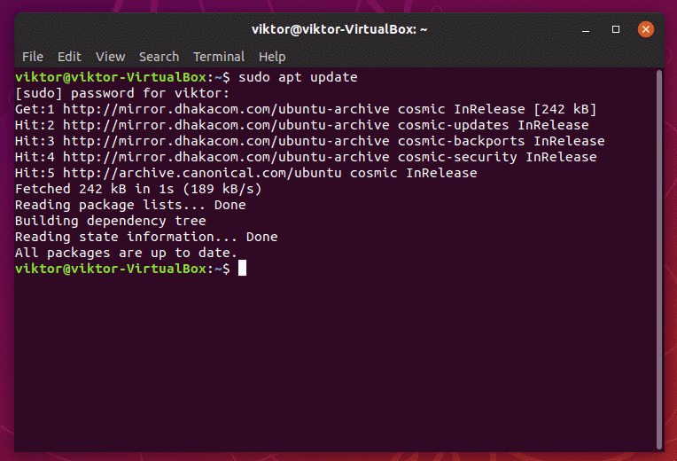
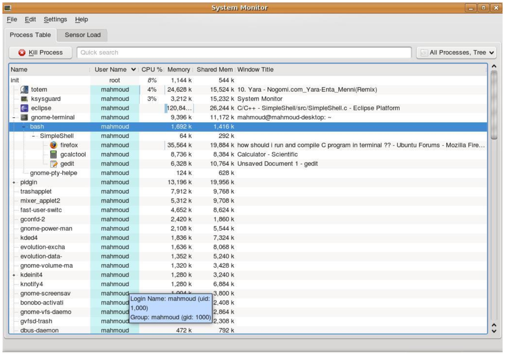

# Simple Shell



## Objectives

1. Familiarity with system calls in Unix environment.
2. Introduction to processes and multi-processing.

## Problem Statement

It is required to implement a Unix shell program. A shell is simply a program that conveniently allows you to run other programs. Read up on your favorite shell to see what it does.

Your shell must support the following commands:

1. The internal shell command "exit" which terminates the shell
    * **Concepts**: shell commands, exiting the shell.
    * **System calls**: exit()
2. A command with no arguments
    * **Example**: ls, cp, rm …etc
    * **Details**: Your shell must block until the command completes and, if the return code is abnormal, print out a message to that effect.
    * **Concepts**: Forking a child process, waiting for it to complete and synchronous execution.
    * **System calls**: fork(), execvp(), exit(), wait()
3. A command with arguments
    * **Example**: ls –l
    * **Details**: Argument 0 is the name of the command.
    * **Concepts**: Command-line parameters.
4. A command, with or without arguments, executed in the background using &.
    * **Example**: firefox &
    * **Details**: In this case, your shell must execute the command and return immediately, not blocking until the command finishes.
    * **Concepts**: Background execution, signals, signal handlers, processes and asynchronous execution.
    * **Requirements**: You have to show that the opened process will be nested as a child process to the shell program via opening the task manager found in the operating system like the one shawn in figure 1. Additionally you have to write in a log file when a child process is terminated (main application will be interrupted by a SIGCHLD signal). So you have to implement an interrupt handler to handle this interrupt and do the corresponding action to it.

|  |
|:--:|
| *Figure 1 Firefox, Calculator and Gedit are child processes to the SimpleShell process** |

## Problem Description

To process the user command, do the following:

1. Your command shell should take the user command and its parameter(s), i.e., “ls” and “–l” in this example, and convert them into C strings. (Recall that a C string terminates with a null string, i.e., \0.)
2. The command shell should create a child process via **fork()**.
3. The child process passes the C strings—the command and parameter(s)—to **execvp()**.
4. The child exits if **execvp()** returns error.
5. The parent process, i.e., the command shell, should wait, via **wait(child_id)**, for the child process to finish.
6. The command shell gets the next command and repeats the above steps. The command shell terminates itself when the user types exit.

In case a user wants to execute the command in background (i.e. as a background process), he/she writes & at the end of the command. For example, a user command can be:

Shell > firefox &

In this case, your command shell should not wait for the child by skipping the Step 5.

You should keep a log file for your shell program such that whenever a child process terminates, the shell program appends the line “Child process was terminated” to the log file. To do this, you have to write a signal handler that appends the line to the log file when the SIGCHLD signal is received.

## Notes

* You should register the SIGCHLD signal at the beginning of your main as shawn in [this example](https://docs.oracle.com/cd/E19455-01/806-4750/signals-7/index.html), so when a child dies, the parent process receives SIGCHLD (or SIGCLD) signal.
* The parent should always wait on the child_id, don't wait on (-1) or any other hacks you might find on the internet.
* To see the set of all signals supported on your system, type, kill –l.
* Use a process monitor package to monitor your processes. Provide a screenshot for your shell parent process and some child processes spawned as background processes. Suggested packages: KSysguard or Gnome-System-Monitor.

## Deliverables

* Complete C source code, commented thoroughly and clearly.
* A report that includes:
  * A description of the overall organization of your code and the major functions.
  * Sample runs.
  * screenshots for the processes hierarchy in KSysguard (or any similar package) during the execution of your shell program.
* A 3-min (tolerance of 30 seconds only) video that shows the output of the next test case.

## Test Case

**Open** your shell.

**Execute** the following commands.

```Shell
ls
mkdir test
ls
ls -a -l -h
```

**Execute** the following commands in the same session, but **show** that shell is stuck and cannot execute other commands while firefox is open.

```Shell
firefox
```

**Close** the firefox.

**Open** the log file, show us its content, then close it.

**Execute** the following commands in the same session, but **show** that shell is not stuck and can execute other commands while firefox is open.

```Shell
firefox &
```

**Open** the log file, show us its content, then close it.

**Open** the system monitor and expand all running processes under your shell process.

**Open** the system monitor and **Search** for all firefox processes.

**Execute** the following commands in the same session, it should show us an error message.

```Shell
heyy
exit
```

That's it with the test!

## Lab requirements

* Students will be working individually.
* You can only use C programming language.
* Use Ubuntu operating system for development.
* Submit the deliverables using the submission form provided in your class.
* If the submitted code cannot replicate the same video scenario, then this will be considered cheating and the "cheating and plagiarism" policy will be applied.
