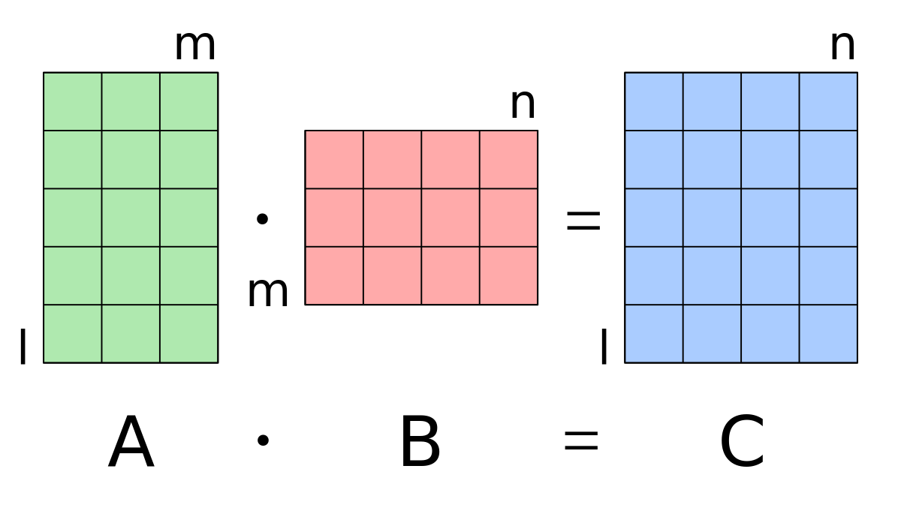
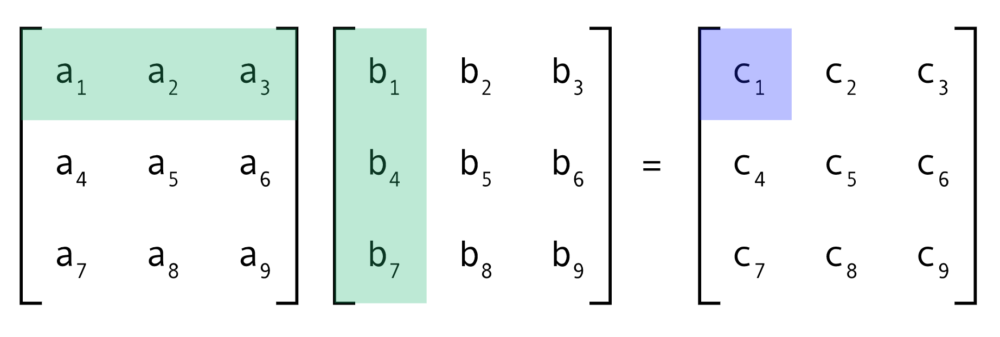

# Matrix Multiplication (Multi-Threading)



## 1. Objectives

* To get familiar with thread programming using the [Pthread library](https://hpc-tutorials.llnl.gov/posix/).
* To better understand processes and threads.

## 2. Overview

You are required to implement a multi-threaded [matrix multiplication](https://www.mathsisfun.com/algebra/matrix-multiplying.html) program.

The input to the program is two matrixes A(x*y) and B(y*z) that are read from corresponding text files. The output is a matrix C(x*z) that is written to an output text file.

A parallelized version of matrix multiplication can be done using one of these three methods:

1. A thread computes the output C matrix i.e. without multi-threading. (A thread per matrix).

2. A thread computes each row in the output C matrix. (A thread per row).

3. A thread computes each element in the output C matrix. (A thread per element).


## 3. Requirements

* Implement the multi-threaded matrix multiplication using all three methods described above.
* Compare the three implementations according to the following:
    1. Number of threads created.
    2. Execution time taken.
* Your program need to handle any errors and terminate gracefully.
* You should work on this lab individually.

Your programs should do the following:

* Your program is executed as: ./matMultp Mat1 Mat2 MatOut, where Mat1 and Mat2 are the names of the text files to read the first and second matrices, respectively. MatOut is the name of the text file to write the output matrix. If the user does not enter this information, the default is a.txt and b.txt, for input matrixes A and B, respectively, and c.out for the output matrix.
* Read the number of rows and columns of the input matrixes. They are written in the first line of the file as ”row=x col=y”.
* Read the input matrixes from their corresponding files. Each row is on a separate line, columns are separated by tabs.
* Use threads to calculate the matrix that results from multiplying the input two matrixes.
* Output the resulting matrix in a file.
* Output to the number of threads created and the time taken on the standout for all the three methods.

## 4. Deliverables

* Complete source code in C, commented thoroughly and clearly.
* A make file that we can use to compile/build your code. Note that you need to call the executable matmult.out.
* A report that describes the following:
    1. How your code is organized.
    2. Your code main functions.
    3. How to compile and run your code.
    4. Sample runs.
    5. A comparison between the three methods of matrix multiplication.
* A 2-min (tolerance of 30 seconds only) video that shows the output of those test cases ([test1](test1/), [test2](test2/) & [test3](test3/)).

## 5. Hints

To measure the execution time, you will need to use code that is similar to this:

```C
#include <sys/time.h>

main()
{
    struct timeval stop, start;

    gettimeofday(&start, NULL); //start checking time
    //your code goes here
    gettimeofday(&stop, NULL); //end checking time

    printf("Seconds taken %lu\n", stop.tv_sec - start.tv_sec);
    printf("Microseconds taken: %lu\n", stop.tv_usec - start.tv_usec);
}
```
